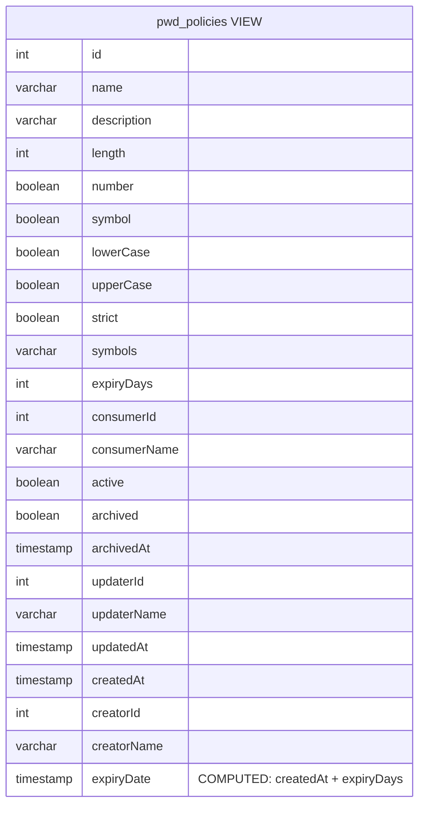

```mermaid
---
caption: Views Entity Relationship Diagram 
---

erDiagram

  pwd_policies["pwd_policies VIEW"] {
    int id
    varchar name
    varchar description
    int length
    boolean number
    boolean symbol
    boolean lowerCase
    boolean upperCase
    boolean strict
    varchar symbols
    int expiryDays
    int consumerId
    varchar consumerName
    boolean active
    boolean archived
    timestamp archivedAt
    int updaterId
    varchar updaterName
    timestamp updatedAt
    timestamp createdAt
    int creatorId
    varchar creatorName
    timestamp expiryDate "COMPUTED: createdAt + expiryDays"
  }
```
