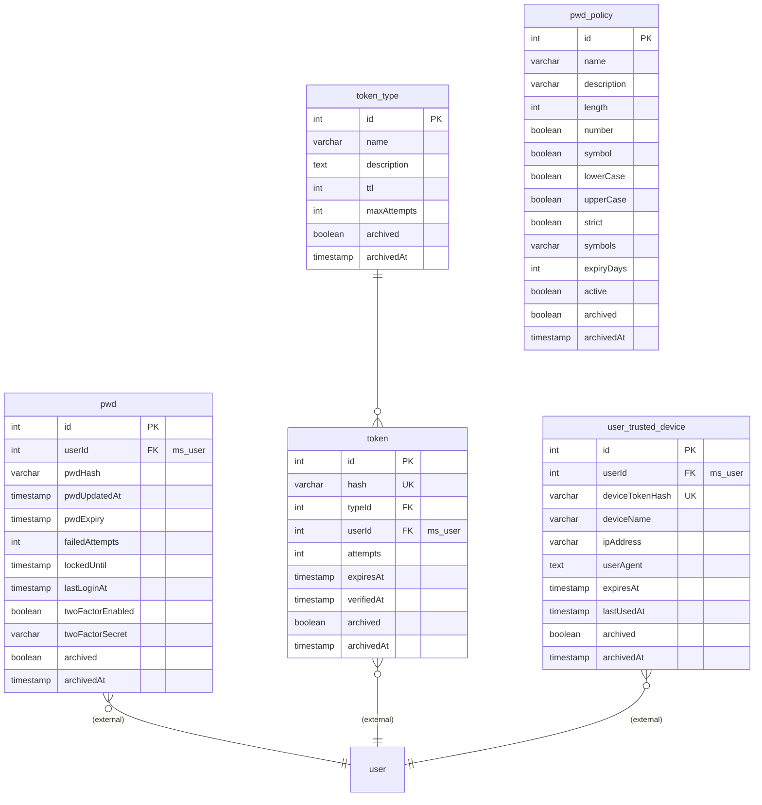
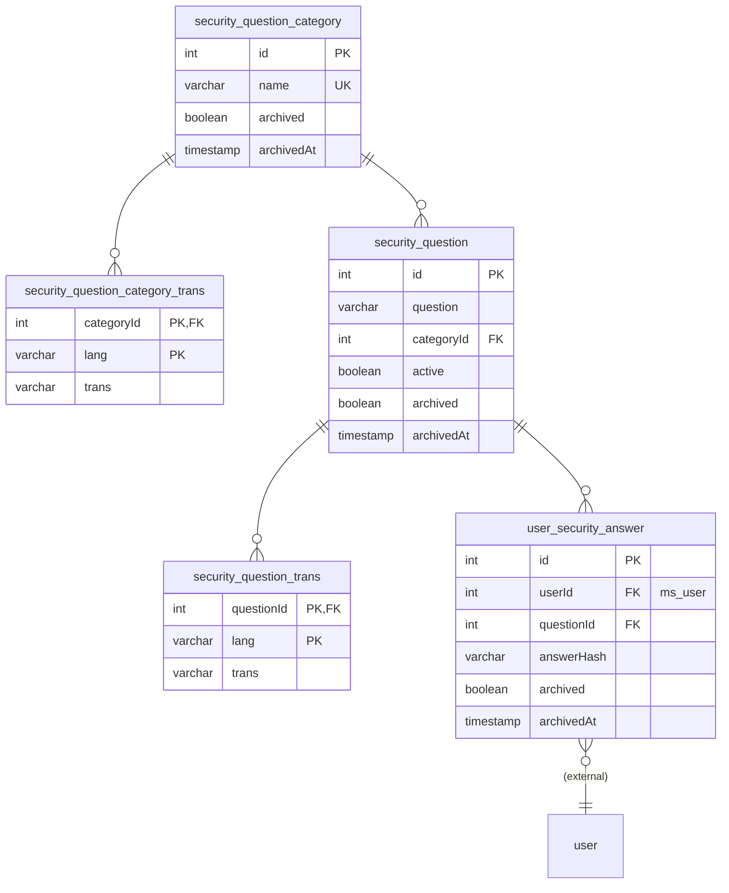

```mermaid
---
caption: Entity Relationship Diagram - Password, Tokens & Trusted Devices
---

erDiagram

  pwd }o--|| user : "(external)"
  token_type ||--o{ token : ""
  token }o--|| user : "(external)"
  user_trusted_device }o--|| user : "(external)"

  pwd {
    int id PK
    int userId FK "ms_user"
    varchar pwdHash
    timestamp pwdUpdatedAt
    timestamp pwdExpiry
    int failedAttempts
    timestamp lockedUntil
    timestamp lastLoginAt
    boolean twoFactorEnabled
    varchar twoFactorSecret
    boolean archived
    timestamp archivedAt
  }

  pwd_policy {
    int id PK
    varchar name
    varchar description
    int length
    boolean number
    boolean symbol
    boolean lowerCase
    boolean upperCase
    boolean strict
    varchar symbols
    int expiryDays
    boolean active
    boolean archived
    timestamp archivedAt
  }

  token_type {
    int id PK
    varchar name
    text description
    int ttl
    int maxAttempts
    boolean archived
    timestamp archivedAt
  }

  token {
    int id PK
    varchar hash UK
    int typeId FK
    int userId FK "ms_user"
    int attempts
    timestamp expiresAt
    timestamp verifiedAt
    boolean archived
    timestamp archivedAt
  }

  user_trusted_device {
    int id PK
    int userId FK "ms_user"
    varchar deviceTokenHash UK
    varchar deviceName
    varchar ipAddress
    text userAgent
    timestamp expiresAt
    timestamp lastUsedAt
    boolean archived
    timestamp archivedAt
  }

  user {

  }
```

```mermaid
---
caption: Entity Relationship Diagram - Security Questions
---

erDiagram

  security_question_category ||--o{ security_question_category_trans : ""
  security_question_category ||--o{ security_question : ""
  security_question ||--o{ security_question_trans : ""
  security_question ||--o{ user_security_answer : ""
  user_security_answer }o--|| user : "(external)"

  security_question_category {
    int id PK
    varchar name UK
    boolean archived
    timestamp archivedAt
  }

  security_question_category_trans {
    int categoryId PK, FK
    varchar lang PK
    varchar trans
  }

  security_question {
    int id PK
    varchar question
    int categoryId FK
    boolean active
    boolean archived
    timestamp archivedAt
  }

  security_question_trans {
    int questionId PK, FK
    varchar lang PK
    varchar trans
  }

  user_security_answer {
    int id PK
    int userId FK "ms_user"
    int questionId FK
    varchar answerHash
    boolean archived
    timestamp archivedAt
  }

  user {

  }
```
