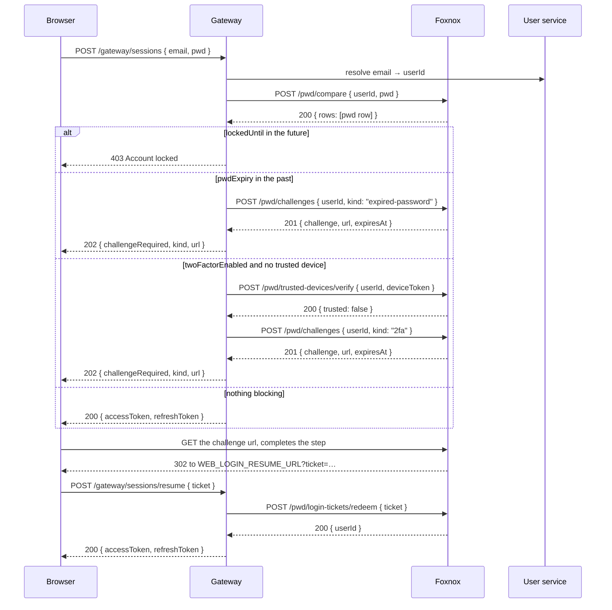

# Login Challenges

A login challenge is what happens when the password was right but the sign-in still cannot finish. Foxnox mints a short-lived token bound to one specific next step, and the gateway answers the login request with **202** instead of a session.

## Why 202

A login has more than two outcomes. "Wrong password" is a 401 and "here is your session" is a 200, but "correct password, now prove you hold the second factor" is neither — the credentials were accepted, yet no session exists yet.

Returning **202 Accepted** with a URL lets the gateway say exactly that, and keeps the decision of *which* extra step is needed inside Foxnox where the `pwd` row lives.

## The Three Kinds

| Kind | Token type | Workflow page | Raised when |
|---|---|---|---|
| `expired-password` | Expired password challenge | `/password/expired` | `pwdExpiry` is in the past |
| `2fa` | 2FA challenge | `/2fa/verify` | `twoFactorEnabled` is true and no valid trusted-device cookie |
| `trusted-device` | Trusted device challenge | `/trusted-devices/prompt` | Offered after a successful 2FA check |

Order matters. An expired password is checked before 2FA, because there is no point verifying a second factor for a credential the user is about to be forced to replace.

## Login Flow



The important detail is the last three steps. Completing a challenge does not create a session — Foxnox cannot, it does not issue tokens. Instead it hands the browser a **login resume ticket**, and the gateway trades that ticket for a session.

## Mint a Challenge

Called by the gateway after a successful password check. Also useful directly for testing.

```
POST /pwd/challenges
Content-Type: application/json
Authorization: Bearer <access_token>

{
  "userId": 1,
  "kind": "2fa"
}
```

`kind` must be one of `2fa`, `expired-password`, or `trusted-device`.

**Response (201 Created):**

```json
{
  "kind": "2fa",
  "challenge": "9f2c1a…",
  "path": "/2fa/verify",
  "url": "http://localhost:8100/api/pwd/web/2fa/verify?challenge=9f2c1a…",
  "expiresAt": "2026-08-19T18:10:00.000Z"
}
```

| Field | Description |
|---|---|
| `kind` | The challenge kind that was minted |
| `challenge` | The plaintext token — returned once, stored only as a hash |
| `path` | Workflow page path, relative to the web base |
| `url` | Absolute URL to redirect the browser to, built from `WEB_PUBLIC_ORIGIN` + `WEB_PUBLIC_BASE` |
| `expiresAt` | When the challenge stops being valid |

Redirect the browser to `url`; the query parameter is named `challenge`, not `token`, which is how the pages tell a mid-login step apart from an email link.

## Verify a Trusted Device

```
POST /pwd/trusted-devices/verify
Content-Type: application/json

{
  "userId": 1,
  "deviceToken": "<value of the trusted_device cookie>"
}
```

**Response (200 OK):** `{ "trusted": true }` — see [Trusted Devices](./api-trusted-devices#verify-a-device-token).

Checking this before minting a 2FA challenge is what stops the service asking for a code on every single sign-in from the user's own laptop.

## Redeem a Login Ticket

Called by the gateway when the frontend posts a ticket to `POST /gateway/sessions/resume`.

```
POST /pwd/login-tickets/redeem
Content-Type: application/json

{
  "ticket": "b71e4d…"
}
```

**Response (200 OK):**

```json
{ "userId": 1 }
```

**Response (400 Bad Request):** `{ "error": "Missing ticket" }` or `{ "error": "Invalid or expired ticket" }`.

Tickets last 10 minutes and have a maximum of **one** attempt, so redeeming is genuinely one-shot: a second call with the same ticket fails, and a reloaded resume URL is correctly rejected rather than minting a second session.

## Challenge Chaining

One login can require more than one step, and each completed page mints the next challenge rather than returning to the gateway. Verifying a 2FA code, for example, consumes the 2FA challenge and redirects to the trusted-device prompt with a **fresh** challenge attached.

Only the final page in the chain issues the login resume ticket. From the frontend's point of view none of this is visible: it redirects once on 202 and waits for the browser to come back with `?ticket=…`.
