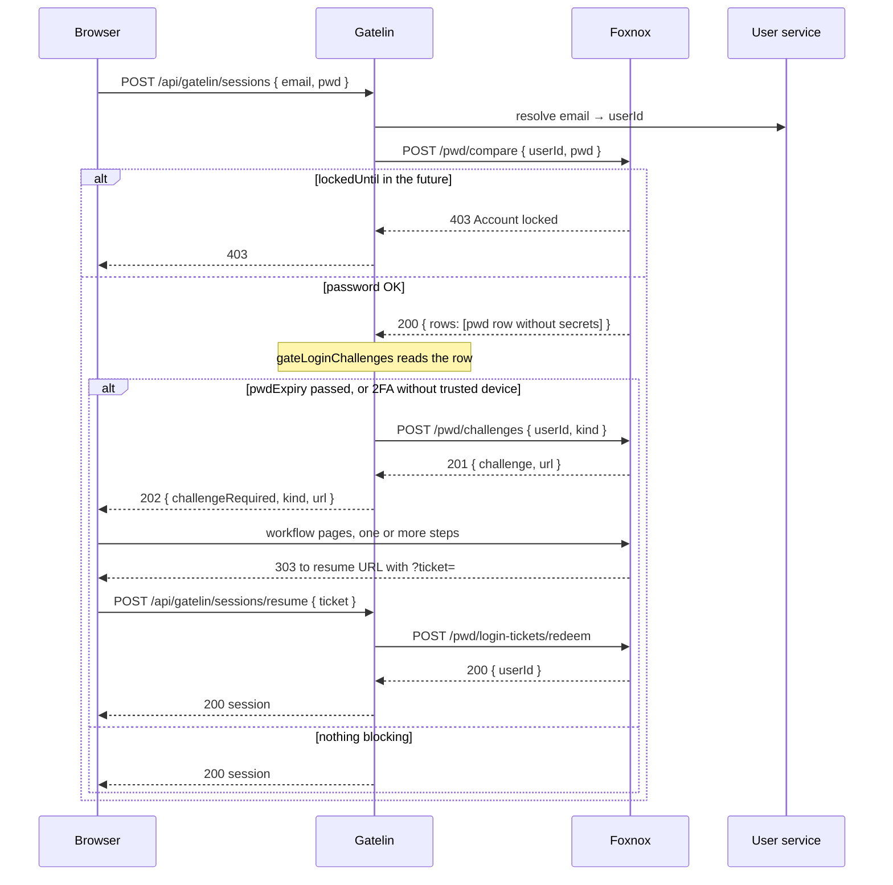

# Request Flow & Architecture

## Request Pipeline

```
Client Request
    ↓
[express.json] - JSON body parsing, 100kb limit
    ↓
[/pwd/health] - Liveness + DB readiness (registered first, bypasses everything else)
    ↓
[startTimer] - Performance measurement
    ↓
[/pwd/web/assets] - Static CSS/JS for the workflow pages
    ↓
[/pwd/web] - Account workflow pages (Handlebars SSR)
    │     express.urlencoded → csrfProtection → page handler
    ↓
[JSON routers] - Most specific mount first
    ├── /pwd/tokens            → token CRUD          → send(tEnt)
    ├── /pwd/policies          → policy CRUD         → send(ppEnt)
    ├── /pwd/trusted-devices/verify → device check
    ├── /pwd/trusted-devices   → device CRUD         → send(tdEnt)
    ├── /pwd/challenges        → mint login challenge
    ├── /pwd/login-tickets     → redeem resume ticket
    └── /pwd/                  → password CRUD + compare → sendPwd
    ↓
[errorHandler]
```

Two details of this ordering are load-bearing.

**Health is registered before the timer and every router**, so a liveness probe never depends on anything else working. `/pwd/health` is dependency-free; `/pwd/health/ready` additionally runs `SELECT 1` against Postgres so an instance that lost its database leaves rotation instead of failing requests.

**The catch-all `/pwd/` router is mounted last.** Express matches `app.use` middleware in registration order, so if the password router came first it would swallow paths like `/pwd/policies/search` before the real router ever saw them.

## Response Middlewares

Every JSON router ends in a terminal response middleware, and which one it uses is what keeps secrets out of responses:

| Middleware | Used by | Strips |
|---|---|---|
| `send(ppEnt)` | policies | nothing — no private fields |
| `send(tEnt)` | tokens | `hash` |
| `send(tdEnt)` | trusted devices | `deviceTokenHash` |
| `sendPwd` (`send(pEnt)`) | passwords | `pwdHash`, `twoFactorSecret` |

The entity definitions mark these fields `isPrivate`, which lets the service `SELECT` them for internal work — comparing a password, verifying a TOTP code, matching a device cookie — while the response layer removes them before serialization. Privacy is enforced once, at the boundary, rather than in each handler.

When Gatelin forwards a permission with data restrictions, Foxnox enforces both headers around each JSON CRUD entity:

- `x-acl-fields` filters incoming write rows before entity validation and projects outgoing rows, schema descriptors, and history `record` snapshots. `id` is always retained. An omitted header is unrestricted; an empty header allows only `id`.
- `x-acl-conditions` is a JSON array of `{ field, op, value }`. Search predicates are forced into the query with `AND`. Inserts must satisfy the partition (an absent equality field is injected), and update/archive/history target IDs are checked before the operation. Updates cannot move a row outside its partition.
- `x-consumer-user-id` and `x-consumer-name` are mapped to `res.locals.consumer`, which lets `antity-pgsql` stamp creator/updater audit columns on inserts, updates, and archives.

Malformed ACL or consumer headers, unknown/non-filterable fields, and unsupported operators fail closed with **403**. Private entity properties are stripped before field projection and can never be re-enabled by an ACL header.

## Two Middleware Chains

The JSON and HTML surfaces are protected in completely different ways, because their clients are different.

**JSON routes** carry no session logic of their own. Authentication and route permission checks happen in Gatelin. Foxnox then enforces the field and row restrictions Gatelin resolved in `x-acl-fields` and `x-acl-conditions` at its own data boundary.

**Workflow pages** parse form bodies and enforce a signed double-submit CSRF check on every non-`GET`: a `foxnox_csrf` cookie plus a matching hidden field, both required, valid for an hour. Failures get **403** with no body. On top of that, forms carry a honeypot field and a render timestamp, and suspicious submissions get **204** with no explanation. See [How Workflows Work](./workflows#form-protections).

## Where Foxnox Sits

```
┌─────────────────────────────────────────────────┐
│                  Reverse Proxy                   │
│                    (Traefik)                     │
│              http://your-domain.com              │
└────────────┬─────────────────────┬───────────────┘
             │                     │
   ┌─────────▼─────────┐  ┌────────▼──────────┐
   │   Admin Panel     │  │   Gatelin (BFF)   │
   │   /foxnox/*       │  │   /api/*          │
   │   (Angular)       │  │   (Node.js)       │
   └───────────────────┘  └────────┬──────────┘
                                   │  internal network only
                          ┌────────▼──────────┐
                          │      Foxnox       │
                          │  /pwd  /pwd/web   │
                          │     (Node.js)     │
                          └────────┬──────────┘
                                   │
             ┌─────────────────────┼─────────────────┐
             │                     │                 │
   ┌─────────▼─────────┐  ┌────────▼───────┐  ┌──────▼──────┐
   │   PostgreSQL      │  │  User service  │  │    SMTP     │
   │   (foxnox DB)     │  │ USER_SEARCH_URL│  │             │
   └───────────────────┘  └────────────────┘  └─────────────┘
```

Foxnox has **no public route**. Every request reaches it through Gatelin, which is what keeps `/pwd/compare` off the open internet. The consequence is that Foxnox cannot infer its own public address, which is why the [public URL variables](./configuration#public-urls) have to be set explicitly for email links to work.

## Login, End to End

The interesting flow is a sign-in, because it involves both surfaces and three services.



Note the division of labour. Foxnox answers questions about credentials and hosts the pages that fix problems; Gatelin decides what those answers mean and issues the session. Foxnox never mints a JWT, which is why finishing a challenge produces a ticket rather than a login.

## Internal Integration Endpoints

Four endpoints are called by Gatelin rather than by clients, all derived from the base of `PWD_CHECK_URL`:

| Endpoint | Called when |
|---|---|
| `POST /pwd/compare` | Every login, to verify the password (also returns **403** when the account is locked) |
| `POST /pwd/trusted-devices/verify` | Before minting a 2FA challenge, to check the device cookie |
| `POST /pwd/challenges` | When a mid-login step is required |
| `POST /pwd/login-tickets/redeem` | When the frontend resumes after a challenge |

See [Login Challenges](./api-challenges).

## Background Jobs

Started with the process, before the HTTP listener:

- **Delete archived entities** — daily 02:00 UTC; removes passwords, tokens, policies, and trusted devices archived for more than 2 months
- **Delete old history** — daily 03:00 UTC; removes `log.history` rows older than 6 months

Neither job is responsible for expiry. Expired tokens and lapsed device trust stop working because every lookup filters on `expiresAt`, not because something deleted them — which is why security does not depend on a cron job having run.

## Technology

| Layer | Choice |
|---|---|
| Runtime | Node.js 24, ES modules |
| HTTP | Express 5 |
| Templates | express-handlebars |
| Database | PostgreSQL 16, via `@dwtechs/antity-pgsql` |
| Migrations | Liquibase 4.28 |
| Hashing | `@dwtechs/hashitaka` (salted PBKDF2 for passwords and security answers; HMAC for tokens and device cookies), `@dwtechs/passken` (generation and compare) |
| TOTP | `otpauth` |
| Mail | Nodemailer |
| Admin UI | Angular 22 with OpenNG Optimus UI |
