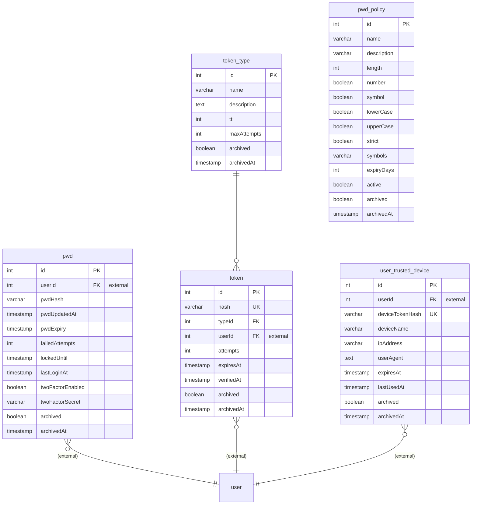
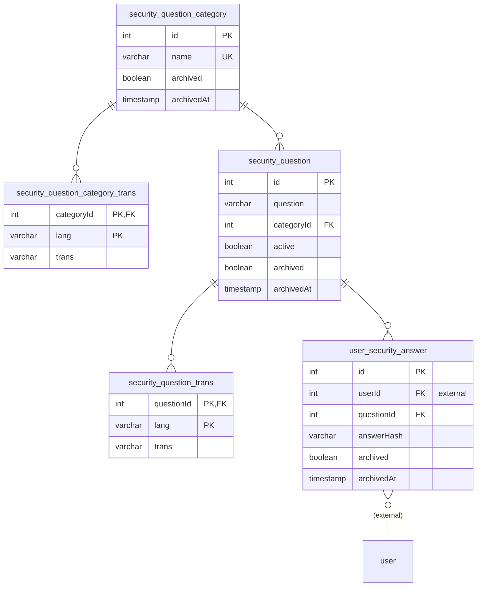

# Data Model

Foxnox owns its own PostgreSQL database (`foxnox` by default). Users live elsewhere — every table refers to them by a plain `userId` with no foreign key, because the user table is in another service's database.

## Credentials, Tokens & Devices

### pwd

One row per user, and the single source of truth for whether a sign-in can proceed. Everything the gateway needs — hash, expiry, lockout state, 2FA flag — is in this row, which is why a login needs exactly one call to Foxnox.

`pwdHash` and `twoFactorSecret` are marked private: readable internally, never serialized into a response.

### pwd_policy

Password rules as data. Exactly one row is `active`, and it is read at the moment a password is created or changed rather than at boot — so activating a new policy takes effect on the next password change without a restart.

### token_type

Reference data seeded by the migration, holding the `ttl` (minutes) and `maxAttempts` for each kind of token. Putting these limits in a table is what lets "reset links last 30 minutes, 2FA challenges last 10" be configuration rather than code. See [Tokens](./api-tokens#how-it-works) for the seeded set.

### token

One row per outstanding link or challenge. `hash` is unique and is an HMAC of the plaintext — the plaintext itself exists only in the URL that was sent, so this table cannot be read back into working links.

Three columns make tokens single-use and bounded: `expiresAt` filters every lookup, `verifiedAt` marks consumption, and `attempts` counts failures against the type's ceiling.

### user_trusted_device

One row per remembered browser. `deviceTokenHash` is the HMAC of the cookie value and is unique. The device name, IP address, and user agent exist so the management page can show a user something recognisable.

## Security Questions

The `_trans` tables hold one row per language for each question and category. Splitting text from identity is what lets a question be displayed in French while keeping a stable numeric ID — so an answer enrolled in one language still matches when the user recovers in another.

`user_security_answer` stores only `answerHash`. Answers cannot be read back, which means a user who forgets them can only re-enroll.

## Conventions

Every table follows the same three patterns, which is worth knowing because it explains behaviour you will see across the whole API.

**Soft deletion.** Nothing is deleted by the application. `archived` and `archivedAt` flag a row, and it immediately stops matching queries — which is why revoking a device or a token takes effect at once. The nightly job hard-deletes archived rows after two months.

**Audit columns.** Every table carries `createdAt`, `creatorName`, `updatedAt`, and `updaterName`. Rows written by the service itself rather than by a user are stamped with `creatorId = -1` and the name `system`.

**History triggers.** Database triggers record every change into `log.history`, exposed per row through the `GET /:id/history` endpoints. History older than six months is purged nightly.

## Migrations

The schema is managed by Liquibase in `db/liquibase/pwd/`, applied by the `dwtechs/foxnox-migration` container. Changesets are grouped by purpose — structure, triggers, and seed data — and the migration also creates the database and the application user on a fresh install. See [Deployment](./deployment#database-migration).

There is also a `pwd_policies` **view** that adds a computed `expiryDate`, so callers can read when a password expires without recalculating it from `expiryDays`.
