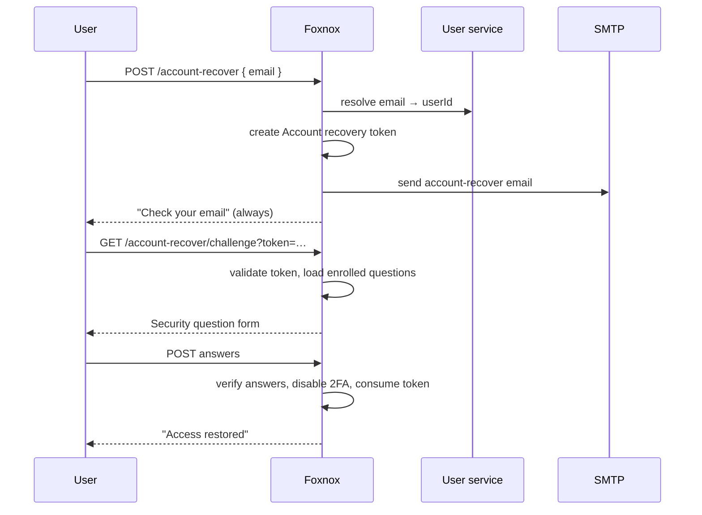

# Lost 2FA Recovery

The escape hatch for a user who still knows their password but cannot produce a 2FA code — a lost or wiped phone, or an authenticator app that was never backed up. Without this, enabling 2FA would risk permanently locking people out of their own accounts.

Recovery works by proving identity a second way: the user must both control the account's mailbox **and** answer the [security questions](./workflow-security-questions) they enrolled earlier. On success, 2FA is switched off so they can sign in with their password alone.

Driven by the **Account recovery** token type: 60 minute lifetime, 3 attempts.

## Pages

| Page | Path | Purpose |
|---|---|---|
| Request | `GET/POST /account-recover` | Enter the account email address |
| Sent | after `POST` | Non-enumerating confirmation |
| Challenge | `GET/POST /account-recover/challenge?token=…` | Answer the enrolled security questions |
| Done | after success | 2FA disabled |
| Invalid | on bad token | Link invalid, expired, used, or no questions enrolled |

## Flow



## Two Factors, Not One

The reason this flow is longer than a password reset is that it removes a security control rather than replacing a credential. A single factor would make it a downgrade attack: anyone with mailbox access could strip 2FA off the account.

Requiring the emailed link *and* the enrolled answers means an attacker needs the mailbox plus knowledge only the user should have.

## Answering the Questions

The challenge page loads the questions the user actually enrolled, in their language, and asks for all of them. Answers are compared against stored hashes; nothing is stored in readable form.

A wrong answer increments the token's attempt counter and re-renders the form with `One or more answers are incorrect. Try again.` — three failures and the token is dead, even inside its 60 minute window. The counter is on the token rather than the account, so a failed recovery attempt cannot be used to lock the user out of normal sign-in.

An incomplete submission is treated the same as a wrong one, which avoids leaking which specific answer was wrong.

## No Questions Enrolled

If the user never set up security questions, the challenge page shows the invalid state instead of a form. There is nothing to verify against, so recovery cannot proceed and an administrator has to disable 2FA manually:

```
PUT /api/foxnox/
Content-Type: application/json
Authorization: Bearer <access_token>

{
  "rows": [
    { "id": 1, "twoFactorEnabled": false }
  ]
}
```

This is the practical argument for prompting users to enroll questions at the same time they enable 2FA — otherwise every lost phone becomes a support ticket.

## What Changes

Success sets `twoFactorEnabled` to false and consumes the token. The password is not changed, and the stored TOTP secret is no longer honoured because 2FA is off.

The done page tells the user to sign in and set 2FA up again. That re-enrollment generates a **new** secret; the old authenticator entry is dead and should be deleted from their app.

## Linking to It

The 2FA verify page already carries a "Lost access to your authenticator?" link here, which is where most users will find it. You can also surface it on your login page:

```
/api/foxnox/web/account-recover
```
