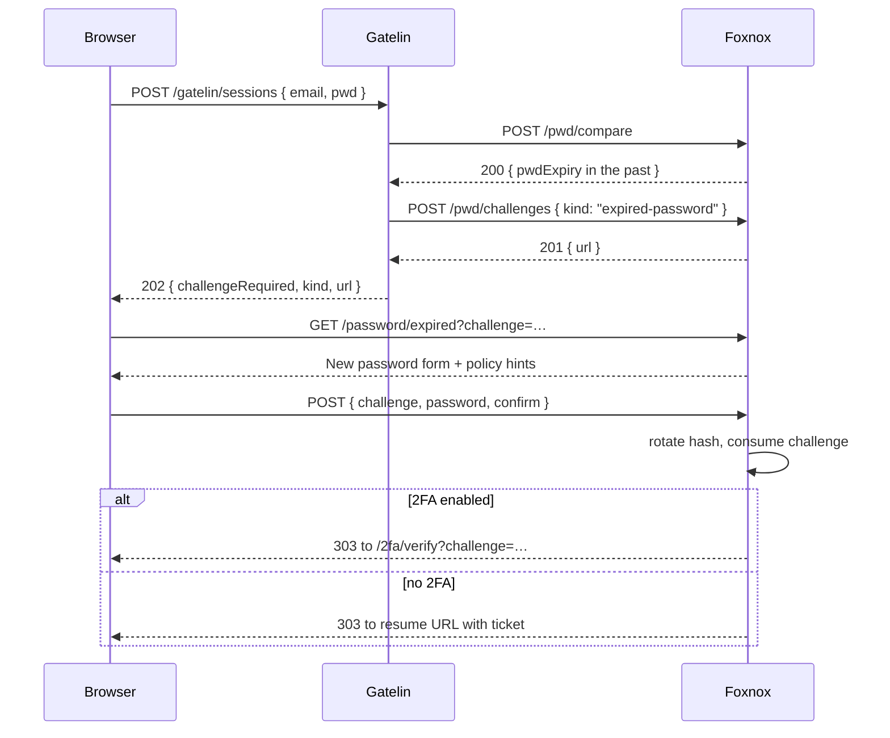

# Expired Password

When a `pwd` row's `pwdExpiry` has passed, the password is still correct but no longer acceptable. Rather than refusing the login outright, Foxnox forces a rotation as part of it: the user sets a new password and the sign-in continues.

Driven by the **Expired password challenge** token type: 15 minute lifetime, 3 attempts.

## Pages

| Page | Path | Purpose |
|---|---|---|
| Expired | `GET/POST /password/expired?challenge=…` | Choose a new password to continue |
| Done | after success | Password rotated |

## Checked Before 2FA

Gatelin evaluates expiry **before** two-factor authentication. There is no point verifying a second factor for a credential the user is about to replace, and doing it in this order means a user with both an expired password and 2FA enabled sets their new password first, then verifies.



## Setting the New Password

The form asks for the password twice and shows the requirements from the in-force [password policy](./api-policies), so the rules on screen are the rules that will be enforced.

| Error | Cause |
|---|---|
| `Passwords do not match.` | The two fields differ |
| `Password does not meet the security policy.` | Too short, or missing a required character class |
| `This session is no longer valid. Sign in again.` | Challenge missing, expired, or already used |

The 15 minute window is shorter than a password reset link's 30 because this is a mid-login step with a browser sitting on the page, not something waiting in an inbox. Letting it lapse means starting the login over — the password itself is unaffected.

## Not the Same as a Reset

These two flows both end with a new password, but they are reached from opposite situations:

| | Expired password | [Password recovery](./workflow-recover) |
|---|---|---|
| User knows the current password | ✅ | ⬜ |
| Entry point | Redirect mid-login | Email link |
| Token in URL | `?challenge=…` | `?token=…` |
| Lifetime | 15 min | 30 min |
| Ends in | The login continuing | The login page |

## What Changes

Rotation writes a new hash, stamps `pwdUpdatedAt`, and computes a fresh `pwdExpiry` from the in-force policy's `expiryDays`. The challenge is consumed so the page cannot be replayed.

The user is then either sent on to 2FA verification or handed a login resume ticket — they never have to type their credentials again.

## Configuring Expiry

Expiry comes from the in-force policy, not from a per-user setting:

```
PUT /api/pwd/policies/
Content-Type: application/json
Authorization: Bearer <access_token>

{
  "rows": [
    { "id": 1, "name": "Public User", "length": 12, "number": true, "symbol": true,
      "lowerCase": true, "upperCase": true, "strict": true, "symbols": "!@#$%^&*",
      "expiryDays": 90, "maxFailedAttempts": 5, "lockoutMinutes": 15 }
  ]
}
```

Set `expiryDays` to `0` to disable expiry entirely. Changing it affects passwords set from that point on; existing rows keep the `pwdExpiry` they were stamped with. To force a specific user to rotate on their next login, set their `pwdExpiry` to a past date through the [passwords API](./api-passwords#update-passwords).
