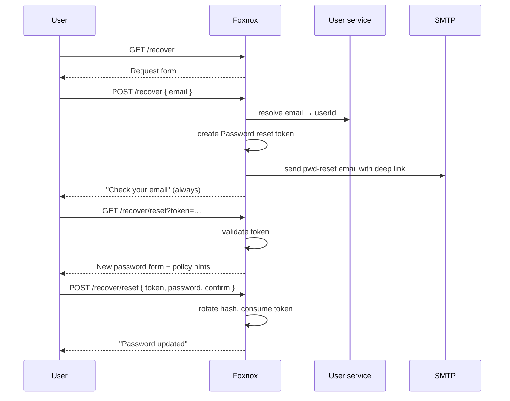

# Password Recovery

The "I forgot my password" flow. A user who cannot sign in asks for a reset link by email, then chooses a new password.

Driven by the **Password reset** token type: 30 minute lifetime, 3 attempts.

## Pages

| Page | Path | Purpose |
|---|---|---|
| Request | `GET/POST /recover` | Enter the account email address |
| Sent | after `POST` | Always shown after submit, to avoid revealing whether the account exists |
| Reset | `GET/POST /recover/reset?token=…` | Choose a new password |
| Done | after `POST` | Password changed |
| Invalid | on bad token | Link missing, expired, or already used |

## Flow



## Requesting a Link

The request form takes an email address and nothing else. What happens next depends on whether that address resolves to a user, but **the page you see does not** — the confirmation is identical either way.

If the address is malformed, the form comes back with `Enter a valid email address.` and a **400**. If the submission looks automated, it is dropped with **204** and no explanation.

## Choosing a New Password

Opening the link validates the token before rendering anything. A missing, expired, consumed, or over-attempted token gets the invalid page with a link to request a fresh one — the form is never shown for a token that could not be used.

The reset form itself asks for the password twice and displays the requirements from the active [password policy](./api-policies), so the rules the user sees are the rules that will actually be applied.

Three things can send the form back:

| Error | Cause |
|---|---|
| `Passwords do not match.` | The two fields differ |
| `Password does not meet the security policy.` | Too short, or missing a required character class |
| `This reset link is invalid or has expired.` | Token failed revalidation between rendering and submitting |

The token is checked again on submit, not just on render. A form left open past the 30 minute window fails at that point rather than rotating the password.

## What Changes

On success, exactly two things happen: the `pwd` row's hash is rotated (with `pwdUpdatedAt` and a fresh `pwdExpiry` derived from the policy), and the token is consumed so the link cannot be reused.

Note what does *not* happen. Lockout state is untouched — a locked account is still locked after a password reset, and the user needs [Account unlock](./workflow-unlock) as well. 2FA is also untouched, so the next sign-in still asks for a code.

## Linking to It

Add this to your login page:

```
/api/pwd/web/recover
```

For the admin UI shipped with Gatelin, set `ADMIN_PASSWORD_RECOVERY_URL=/api/pwd/web/recover` and the "Forgotten password?" link appears on the login form automatically.
