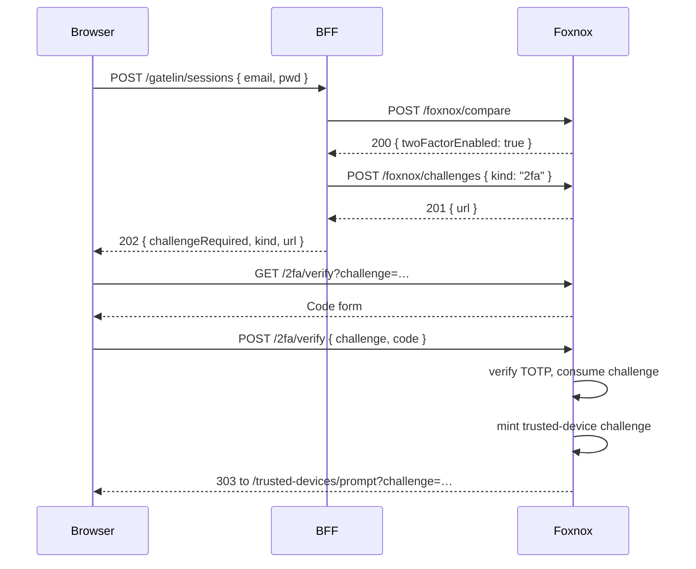

# Two-Factor Authentication

Foxnox implements TOTP two-factor authentication: the user enrolls an authenticator app once, then supplies a 6-digit code during sign-in.

There are two distinct pages here, and they are almost opposites. **Verify** is a mid-login step for a user with no session yet. **Setup** is a settings page for a user who is already signed in.

## Pages

| Page | Path | Protected | Purpose |
|---|---|---|---|
| Verify | `GET/POST /2fa/verify?challenge=…` | ⬜ | Enter a code to finish signing in |
| Setup | `GET/POST /2fa/setup` | ✅ | Enroll an authenticator app |
| Done | after setup | ✅ | 2FA enabled |
| Disabled | after recovery | ⬜ | 2FA switched off following account recovery |
| Invalid | on bad challenge | ⬜ | Challenge missing, expired, or already used |

## Verify

Reached only by redirect. When the BFF sees `twoFactorEnabled` on a `pwd` row and no valid trusted-device cookie, it mints a `2fa` challenge and answers the login with **202** and this page's URL.



The challenge is validated on `GET` as well as `POST`, so an expired link shows the invalid page rather than a form that cannot work. An incorrect code re-renders the form with `That code is not valid. Try again.` and leaves the challenge usable — up to its 5-attempt ceiling, after which the token is dead and the user starts the login again.

Note the last step: success does **not** end the flow. It consumes the 2FA challenge and immediately mints a *trusted-device* challenge, redirecting to the "remember this device?" prompt. Only that page issues the login resume ticket. See [Trusted Devices](./workflow-devices).

The form also carries a "Lost access to your authenticator?" link into [Lost 2FA recovery](./workflow-account-recover) — without it, a user who has changed phones is permanently locked out.

## Setup

A self-service settings page, and the only 2FA route that requires an existing session. Visiting it generates a fresh TOTP secret and renders it as both a QR code and a manually typeable key, so authenticator apps without camera access still work.

The user scans, then types a code back to confirm. That confirmation step is the point of the page: it proves the app and the server agree before 2FA is switched on. Enabling it without verifying would risk locking the user out of their own account.

Only on a valid code is the secret written to the `pwd` row and `twoFactorEnabled` set to true. A wrong code re-renders the form with the same secret still in play.

Because the secret only becomes real on confirmation, abandoning the page mid-way changes nothing.

## Linking to It

Add the setup page to your account settings:

```
/api/foxnox/web/2fa/setup
```

The verify page needs no link — it is only ever reached by redirect from a 202 login response. Your frontend does need to follow that redirect, though. See [Frontend Integration](./frontend).

## Turning 2FA Off

Two routes exist. A user who has lost their authenticator goes through [account recovery](./workflow-account-recover), which disables 2FA after they answer their security questions. An administrator can clear the flag directly:

```
PUT /api/foxnox/
Content-Type: application/json
Authorization: Bearer <access_token>

{
  "rows": [
    { "id": 1, "twoFactorEnabled": false }
  ]
}
```
