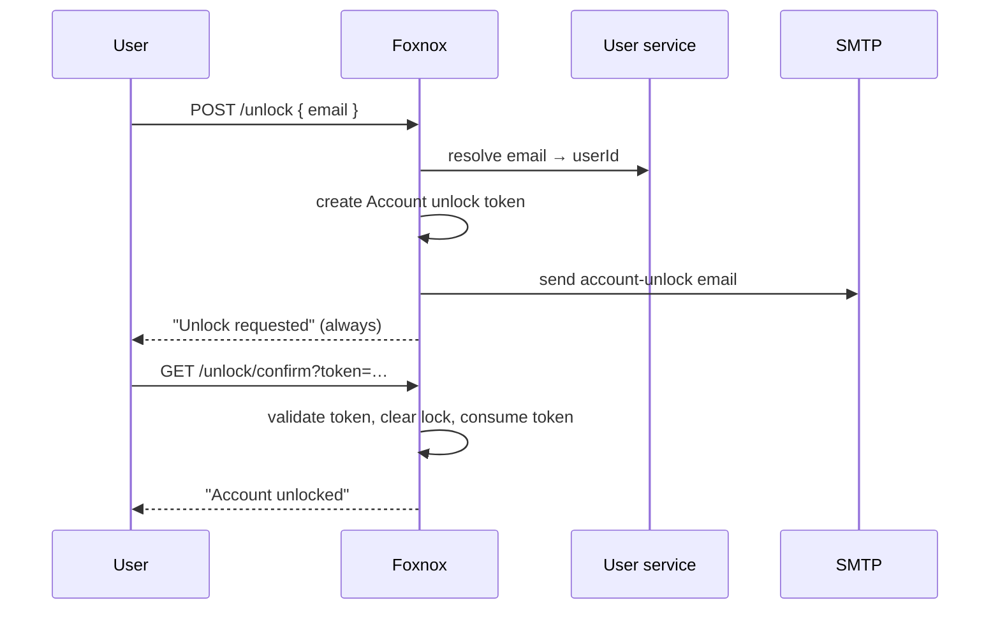

# Account Unlock

After too many failed sign-in attempts, a `pwd` row's `lockedUntil` is set and `POST /pwd/compare` (and therefore login) is refused with **403** until it lapses. How many failures and how long the lock lasts come from the in-force policy's `maxFailedAttempts` and `lockoutMinutes` (defaults 5 and 15). This workflow lets the user clear the lock early instead of waiting.

Driven by the **Account unlock** token type: 30 minute lifetime, 3 attempts.

## Pages

| Page | Path | Purpose |
|---|---|---|
| Request | `GET/POST /unlock` | Enter the account email address |
| Sent | after `POST` | Non-enumerating confirmation |
| Confirm | `GET /unlock/confirm?token=…` | Clears the lock and shows the result |
| Invalid | on bad token | Link missing, expired, or already used |

## Flow



## One Click, No Form

The confirm step is unusual in that it is a `GET` that changes state. Opening the link validates the token, clears the lock, and consumes the token — there is no form to submit. The user goes straight from their inbox to an unlocked account.

That is a deliberate trade-off for usability, and it is safe because the token is single-use, short-lived, and only reachable by whoever controls the mailbox.

## What Changes

Unlocking resets `failedAttempts` to zero and clears `lockedUntil`. The password itself is untouched — the user signs in with the same credentials they had before.

This is worth stating plainly because the two situations feel similar to users but are different problems: if they have forgotten their password *and* locked the account, they need both this workflow and [Password recovery](./workflow-recover).

## The Alternative: Waiting

The request page also tells the user they can simply wait for the lock to expire. That path needs no email at all, which matters when mail delivery is broken or the address on file is stale.

## Administrative Unlock

To clear a lock without involving the user, update the row directly:

```
PUT /api/pwd/
Content-Type: application/json
Authorization: Bearer <access_token>

{
  "rows": [
    { "id": 1, "failedAttempts": 0, "lockedUntil": null }
  ]
}
```

## Linking to It

```
/api/pwd/web/unlock
```

Worth surfacing on the login page next to the 403 error, since a locked-out user has no other obvious route forward.
